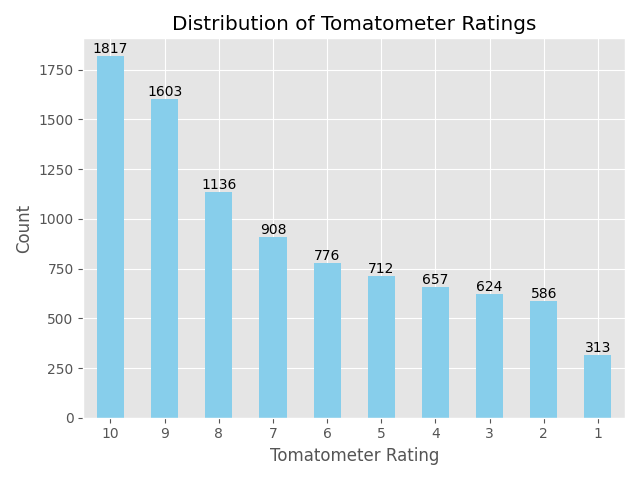
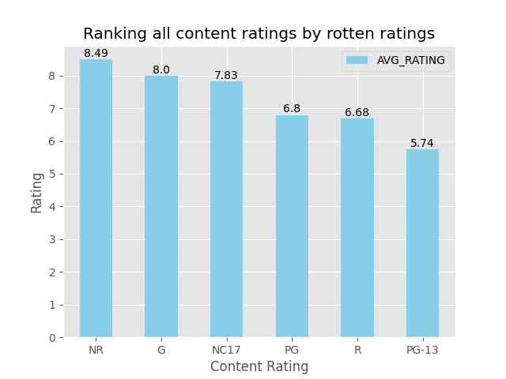
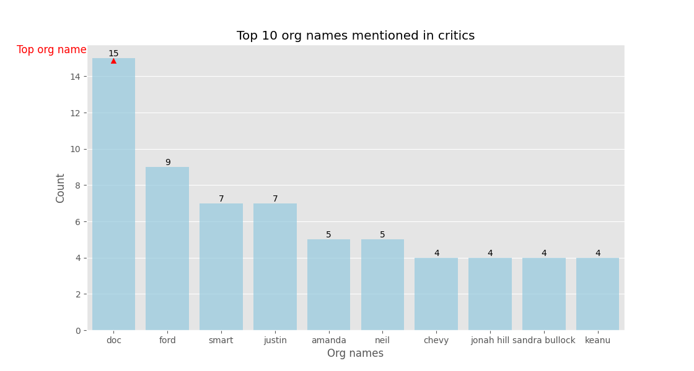
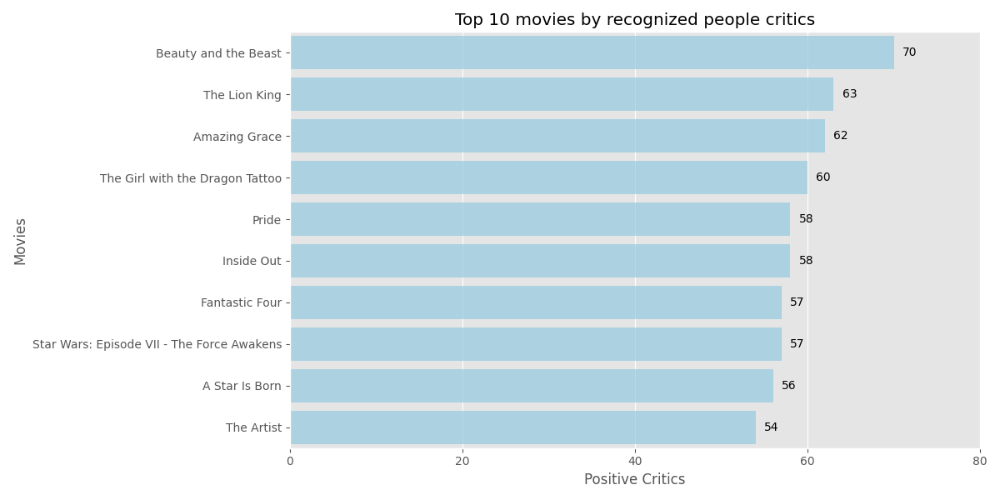
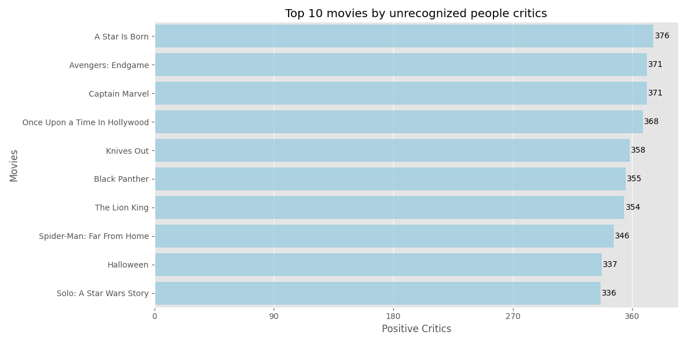

# 🎬 Rotten Tomatoes Review Intelligence Project

## 📊 Objective

This project explores and analyzes critic and user reviews from the Rotten Tomatoes dataset available on Kaggle. Through natural language processing (NLP), named entity recognition (NER), and sentiment analysis techniques, we extract insights about movies, review patterns, and sentiment trends.

---

## 🗂️ Table of Contents

* [📥 Dataset & Structure](#-dataset--structure)
* [🧹 Data Cleaning & Preprocessing](#-data-cleaning--preprocessing)
* [📊 Visual Analysis](#-visual-analysis)
* [🔍 Named Entity Recognition (NER)](#-named-entity-recognition-ner)
* [😊 Sentiment Analysis](#-sentiment-analysis)
* [🏆 Movie Insights](#-movie-insights)
* [🛠️ Technologies Used](#-technologies-used)
* [🚀 How to Run](#-how-to-run)

---

## 📥 Dataset & Structure

Data was sourced from the [Kaggle Rotten Tomatoes Movies and Reviews Dataset]([https://www.kaggle.com/datasets/](https://www.kaggle.com/datasets/stefanoleone992/rotten-tomatoes-movies-and-critic-reviews-dataset/data?select=rotten_tomatoes_movies.csv)). It includes:

* `rotten_tomatoes_movies.csv`: Metadata about films.
* `rotten_tomatoes_critic_reviews.`: Critic and user reviews.

The data was merged into a unified DataFrame and split into two distinct parts:

* `df_rotten`: Contains only rotten critic reviews.
* `df_reviewers`: Contains user reviews.

---

## 🧹 Data Cleaning & Preprocessing

Text data was processed through several NLP techniques:

* Tokenization
* Lowercasing
* Punctuation removal
* Lemmatization and stemming using `WordNetLemmatizer`

This helped to normalize the data for consistent analysis.

### The process!!!
> **Cleaned and structured using Python in VS Code.**  
> ✅ Import and see the data
> ✅ Drop unnecessary columns
> ✅ Info and handling missing values in movies and reviews DataFrames
> ✅ Merge the two DataFrames
> ✅ Create two DataFrames one with critics from rotten and one with critics from reviewers and remove duplicates on both DataFrames
> ✅ Normalize the column tomatometer_rating
> ✅ Data preprocessing
> ✅ Stemming
> ✅ Export the DataFrames

```python
#Import and see the data 
df_movies = pd.read_csv(r"C:\Users\chris\OneDrive\Desktop\ΧΡΗΣΤΟΣ\NLP PROJECT\DATA\rotten_tomatoes_movies.csv")
print(df_movies)
df_reviews = pd.read_csv(r"C:\Users\chris\OneDrive\Desktop\ΧΡΗΣΤΟΣ\NLP PROJECT\DATA\rotten_tomatoes_critic_reviews.csv")
print(df_reviews)

#Drop unnecessary columns
df_movies.columns
df_movies.drop(columns=['movie_info', 'directors', 'authors', 'actors', 'original_release_date', 'streaming_release_date', 'runtime',
       'production_company', 'tomatometer_status',  'tomatometer_count', 'audience_status', 'audience_rating',
       'audience_count', 'tomatometer_top_critics_count',
       'tomatometer_fresh_critics_count', 'tomatometer_rotten_critics_count'], inplace=True)

df_reviews.columns
df_reviews.drop(columns=['critic_name', 'publisher_name',
       'review_type', 'review_score', 'review_date'], inplace=True)

#Info and handling missing values in movies DataFrame
df_movies.info() 
df_movies.isna().sum()
df_movies['genres'] = df_movies['genres'].fillna('Unknown')
df_movies[df_movies['genres'] == 'Unknown']
mean_rating = df_movies['tomatometer_rating'].mean()
df_movies['tomatometer_rating'] = df_movies['tomatometer_rating'].fillna(mean_rating)
df_movies[df_movies['tomatometer_rating'] == mean_rating]

#Info and missing values reviews DataFrame
df_reviews.info()
df_reviews.dropna(subset='review_content', inplace=True)

#Merge the two DataFrames
df = pd.merge(left=df_movies, right=df_reviews, on='rotten_tomatoes_link', how='inner')
df
df.info()
df.columns

#Create two DataFrames one with critics from rotten and one with critics from reviewers and remove duplicates on both DataFrames
df_rotten = df
df_rotten
df_rotten.columns
df_rotten = df_rotten.drop(columns=['top_critic',
       'review_content'])
df_rotten.info()
df_rotten = df_rotten.dropna(subset=['critics_consensus'])
df_rotten.drop_duplicates(inplace=True)

df_reviewers = df
df_reviewers = df_reviewers.drop(columns=['critics_consensus']) 
df_reviewers
df_reviewers.info()
df_reviewers.drop_duplicates(inplace=True)

#Normalize the column tomatometer_rating
df_rotten['tomatometer_rating'].value_counts()
df_rotten['tomatometer_rating'] = df_rotten['tomatometer_rating'].map(lambda x: x // 10 + 1 if x < 100 else 10)

df_reviewers['tomatometer_rating'].value_counts()
df_reviewers['tomatometer_rating'] = df_reviewers['tomatometer_rating'].map(lambda x: x // 10 + 1 if x < 100 else 10)

#Data preprocessing
df_rotten.columns
df_rotten.movie_title
df_rotten.reset_index(inplace=True)
df_rotten.drop(columns=['index'], axis=1, inplace=True)

df_rotten['movie_title'] = df_rotten.movie_title.apply(lambda x: re.sub(r'\((.*?)\)', '', x))
df_rotten['cleaned_critics'] = df_rotten['critics_consensus'].apply(lambda x: re.sub(r'[^\w\s]', '', x))
df_rotten['cleaned_critics'] = df_rotten['cleaned_critics'].apply(lambda x: re.sub(r'\s+', ' ', x))
df_rotten['cleaned_critics'] = df_rotten['cleaned_critics'].apply(lambda x: x.lower())

df_reviewers['movie_title'] = df_reviewers.movie_title.apply(lambda x: re.sub(r'\((.*?)\)', '', x))
df_reviewers['cleaned_critics'] = df_reviewers['review_content'].apply(lambda x: re.sub(r'[^\w\s]', '', x))
df_reviewers['cleaned_critics'] = df_reviewers['cleaned_critics'].apply(lambda x: re.sub(r'\s+', ' ', x))
df_reviewers['cleaned_critics'] = df_reviewers['cleaned_critics'].apply(lambda x: x.lower())

lemmatizer = WordNetLemmatizer()

df_rotten['cleaned_critics'] = df_rotten['cleaned_critics'].apply(lambda x: ' '.join([lemmatizer.lemmatize(token) for token in word_tokenize(str(x))]) if isinstance(x, str) else '')
df_reviewers['cleaned_critics'] = df_reviewers['cleaned_critics'].apply(lambda x: ' '.join([lemmatizer.lemmatize(token) for token in word_tokenize(str(x))]) if isinstance(x, str) else '')


#Export the two DataFrames in csv files
df_rotten.to_csv('Rotten_Reviews_Data.csv')
df_reviewers.to_csv('People_Reviews_data.csv')
```

---

## 📊 Visual Analysis

Using `matplotlib` and `seaborn`, i visualized:

* 📈 Distribution of movies across different rating levels.

```python
df_rotten = pd.read_csv(r"C:\Users\chris\OneDrive\Desktop\ΧΡΗΣΤΟΣ\NLP PROJECT\Rotten_Reviews_Data.csv")
df_reviewers = pd.read_csv(r"C:\Users\chris\OneDrive\Desktop\ΧΡΗΣΤΟΣ\NLP PROJECT\People_Reviews_data.csv")

#Distribution of Tomatometer Ratings in rotten DataFrame 
print(plt.style.available)
plt.style.use('ggplot')
df_rotten.columns
df_rotten['tomatometer_rating'] = df_rotten['tomatometer_rating'].astype(int).astype(str)
df_rotten.tomatometer_rating.value_counts().sort_values(ascending=False).plot(kind='bar', color='Skyblue')
sorted_rating_counts = df_rotten.tomatometer_rating.value_counts().sort_values(ascending=False)
plt.ylabel('Count')
plt.xlabel('Tomatometer Rating')
plt.xticks(rotation=0)
plt.title('Distribution of Tomatometer Ratings')
for i, count in enumerate(sorted_rating_counts.values):
    plt.text(i, count, str(count), ha='center', va='bottom')
plt.tight_layout()
plt.show()
```

  
* 🏷️ Frequency of each content rating (e.g., PG, R, etc.).

```python
#Ranking movies content rating 
df_rotten['tomatometer_rating'] = df_rotten['tomatometer_rating'].astype(int)
df_rotten.groupby('content_rating').agg(AVG_RATING = ('tomatometer_rating', 'mean')).sort_values(by='AVG_RATING',ascending=False)
content_rating = df_rotten.groupby('content_rating').agg(AVG_RATING = ('tomatometer_rating', 'mean')).sort_values(by='AVG_RATING',ascending=False)
content_rating.plot(kind='bar', color='skyblue')
plt.ylabel('Rating')
plt.xlabel('Content Rating')
plt.title('Ranking all content ratings by rotten ratings')
plt.xticks(rotation=0)
for i, count in enumerate(content_rating['AVG_RATING'].round(2)):
    plt.text(i, count, str(count), ha='center', va='bottom')
plt.tight_layout
plt.show()
```


* 🎬 Top 10 most mentioned action movies in the dataset.

```python
#The best action movies by ratings
action_movies = df_rotten[df_rotten['genres'].str.contains('Action')]
top_10_action_movies = action_movies.sort_values(by='tomatometer_rating', ascending=False).head(10)
top_10_action_movies = top_10_action_movies[['movie_title', 'tomatometer_rating']].set_index('movie_title')
top_10_action_movies.to_csv('Top_action_movies.csv')
```
| movie_title	                                   | tomatometer_rating |
|------------------------------------------------|--------------------|
| Zootopia	                                     |                 10 |
| Wonder Woman                                   |	               10 |
| Wings	                                         |                 10 |
| Assault on Precinct 13                         |                 10 |
| Who Framed Roger Rabbit	                       |                 10 |
| White Heat                                     |	               10 |
| Weekend	                                       |                 10 |
| WarGames                                       |	               10 |
| War for the Planet of the Apes                 |	               10 |
| Wallace & Gromit: The Curse of the Were-Rabbit |	               10 |
[Top 10 action movies in csv form](assets/csv_insights/Top_10_action_movies.csv)

All visualizations used bar charts for clarity and comparison.

---

## 🔍 Named Entity Recognition (NER)

With the help of `spaCy`, i applied NER on the critic reviews to:

* Identify named entities (especially ORG labels).
* Count and visualize the most frequently mentioned organizations (e.g., film studios, networks).

### This is what i found

```python
#NER in rotten reviews
nlp = spacy.load("en_core_web_sm")
df_rotten['ner_entities'] = df_rotten['cleaned_critics'].apply(lambda x: [(ent.text, ent.label_) for ent in nlp(x).ents])

#Top 10 Organizations mentioned in rotten critics
df_rotten['org_names'] = df_rotten['cleaned_critics'].apply(lambda x: [ent.text for ent in nlp(x).ents if ent.label_ == 'ORG'])
org_names = [word.lower() for sublist in df_rotten['org_names'] for word in sublist]
org_names_count = pd.Series(org_names).value_counts()
top_10_org_names = org_names_count.head(10)
plt.figure(figsize=(12,6))
sns.barplot(data=top_10_org_names, color='skyblue', alpha=0.7)
plt.annotate("", xytext=(0, 14.90), xy=(0, 14.99), arrowprops=dict(arrowstyle="simple", facecolor='red', edgecolor='red'), fontsize=12, color='red')
plt.text(0, 1, "Top org name", transform=plt.gca().transAxes, fontsize=12, color='red', ha='right', va='top')
for i, count in enumerate(top_10_org_names.values):
    plt.text(i, count, str(count), ha='center', va='bottom')
plt.title('Top 10 org names mentioned in critics')
plt.xlabel('Org names')
plt.ylabel('Count')
plt.xticks(top_10_org_names.index)
plt.show()
```


---

## 😊 Sentiment Analysis

We applied sentiment classification using `TextBlob`:

* Classified each review as `Positive`, `Negative`, or `Neutral`.
* Analyzed sentiment distribution for both `df_rotten` and `df_reviewers`.
* Further divided `df_reviewers` into recognized and non-recognized users.

### Sentiment analysis in rotten reviews

```python
#Sentiment analysis in rotten reviews
df_rotten['sentiment'] = df_rotten['cleaned_critics'].apply(lambda x: 'positive' if TextBlob(str(x)).sentiment.polarity > 0 else ('negative' if TextBlob(str(x)).sentiment.polarity < 0 else 'neutral'))
rotten_sentiment_count = df_rotten['sentiment'].value_counts()

movies_positive_sentiment_rotten = df_rotten[df_rotten['sentiment'] == 'positive'][['movie_title', 'sentiment', 'tomatometer_rating']].reset_index()
movies_positive_sentiment_rotten.drop(columns=['index'], inplace=True)

movies_negative_sentiment_rotten = df_rotten[df_rotten['sentiment'] == 'negative'][['movie_title', 'sentiment', 'tomatometer_rating']].reset_index()
movies_negative_sentiment_rotten.drop(columns=['index'], inplace=True)

movies_neutral_sentiment_rotten = df_rotten[df_rotten['sentiment'] == 'neutral'][['movie_title', 'sentiment', 'tomatometer_rating']].reset_index()
movies_neutral_sentiment_rotten.drop(columns=['index'], inplace=True)

movies_positive_sentiment_rotten.to_csv('Movies_positive_sentiment_rotten.csv')
movies_negative_sentiment_rotten.to_csv('Movies_negative_sentiment_rotten.csv')
movies_neutral_sentiment_rotten.to_csv('Movies_neutral_sentiment_rotten.csv')
```
| Movies with positive sentiment in rotten reviews | Movies with negative sentiment in rotten reviews | Movies with neutral sentiment in rotten reviews |
|--------------------------------------------------|--------------------------------------------------|-------------------------------------------------|
| [Movies](assets/csv_insights/Movies_positive_sentiment_rotten.csv) | [Movies](assets/csv_insights/Movies_negative_sentiment_rotten.csv) | [Movies](assets/csv_insights/Movies_neutral_sentiment_rotten.csv)

### Sentiment analysis in critics of recognized people 

```python
#Sentiment analysis in critics of recognized people 
df_reviewers_recognized = df_reviewers[df_reviewers['top_critic'] == True].reset_index()
df_reviewers_recognized.drop(columns=['index'], inplace=True)

df_reviewers_recognized['sentiment'] = df_reviewers_recognized['cleaned_critics'].apply(lambda x: 'positive' if TextBlob(str(x)).sentiment.polarity > 0 else ('negative' if TextBlob(str(x)).sentiment.polarity < 0 else 'neutral'))
sentiment_count_recognized = df_reviewers_recognized.groupby(['movie_title', 'sentiment']).size().reset_index(name='count')

top_10_movies_sentiment_recognized = sentiment_count_recognized[sentiment_count_recognized['sentiment'] == 'positive'].sort_values(by= 'count', ascending=False).head(10).reset_index()
top_10_movies_sentiment_recognized.drop(columns=['index'], inplace=True)

plt.figure(figsize=(12,6))
sns.barplot(x='count', y='movie_title', data=top_10_movies_sentiment_recognized, color='skyblue', alpha=0.7)
for i, row in top_10_movies_sentiment_recognized.iterrows():
    plt.text(row['count'] + 1, i, str(row['count']), va='center', fontsize=10)
plt.title('Top 10 movies by recognized people critics')
plt.ylabel('Movies')
plt.xlabel('Positive Critics')
plt.xticks(np.arange(0, 85, 20))
plt.tight_layout()
plt.show()
```

### Sentiment analysis in critics of normal people

```python
#Sentiment analysis in critics of normal people
df_reviewers_unrecognized = df_reviewers[df_reviewers['top_critic'] == False].reset_index()
df_reviewers_unrecognized.drop(columns=['index'], inplace=True)

df_reviewers_unrecognized['sentiment'] = df_reviewers_unrecognized['cleaned_critics'].apply(lambda x: 'positive' if TextBlob(str(x)).sentiment.polarity > 0 else ('negative' if TextBlob(str(x)).sentiment.polarity < 0 else 'neutral'))
sentiment_count_unrecognized = df_reviewers_unrecognized.groupby(['movie_title', 'sentiment']).size().reset_index(name='count')

top_10_movies_sentiment_unrecognized = sentiment_count_unrecognized[sentiment_count_unrecognized['sentiment'] == 'positive'].sort_values(by= 'count', ascending=False).head(10).reset_index()
top_10_movies_sentiment_unrecognized.drop(columns=['index'], inplace=True)

plt.figure(figsize=(12,6))
sns.barplot(x='count', y='movie_title', data=top_10_movies_sentiment_unrecognized, color='skyblue', alpha=0.7)
for i, row in top_10_movies_sentiment_unrecognized.iterrows():
    plt.text(row['count']+1, i, str(row['count']), va='center', fontsize=10)
plt.title('Top 10 movies by unrecognized people critics')
plt.ylabel('Movies')
plt.xlabel('Positive Critics')
plt.xticks(np.arange(0, 385, 90))
plt.tight_layout()
plt.show()
```

| Top_10_movies_by_recognized_people_critics | Top_10_movies_by_unrecognized_people_critics |
|--------------------------------------------|----------------------------------------------|
|  |  |

## 🏆 Movie Insights

Finally, we extracted and visualized the movies with the most positive reviews for:

* Critics (from `df_rotten`)
* Recognized reviewers
* General public

Each result was represented using clear bar charts for easy comparison and csv files when the data were large.

---

## 🛠️ Technologies Used

* **Python 3.13** 🐍
* **VS Code** 💻
* **Libraries:**

  * `pandas`, `numpy`
  * `nltk`, `spacy`, `textblob`
  * `matplotlib`, `seaborn`

---

## 🚀 How to Run

1. Clone the repository.
2. Install required libraries:

   ```bash
   pip install -r requirements.txt
   ```
3. Run the above python scripts in your preferred Python environment.

---

## 📬 Contact

For questions or collaborations, please open an issue or contact via [Linkedin](https://linkedin.com/in/christos-zogas-804323320) or [Email](mailto:christoszogas97@gmail.com).

---

> ✅ This project is structured and documented for readability and scalability. Ideal for expanding into more advanced NLP or model-based sentiment prediction tasks.

